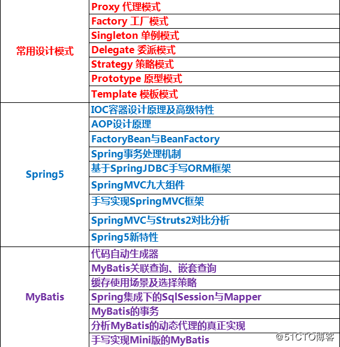
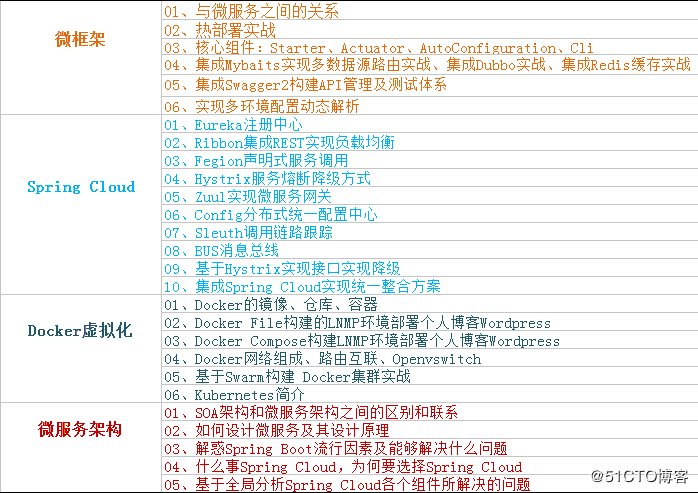
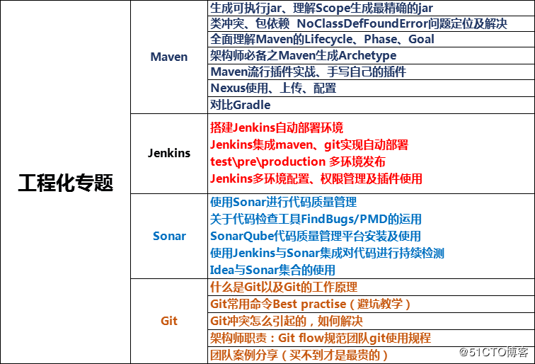
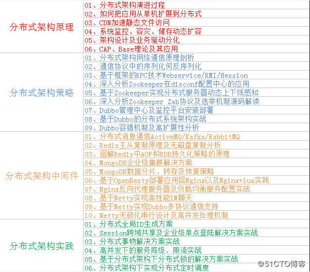

<!-- TOC -->

- [学习整理](#学习整理)
    - [Coding-编程](#coding-编程)
    - [Technology-技术](#technology-技术)
    - [Engineering-工程](#engineering-工程)
    - [Distributed-分布式](#distributed-分布式)

<!-- /TOC -->
# 学习整理

## Coding-编程

## Technology-技术

## Engineering-工程

## Distributed-分布式
